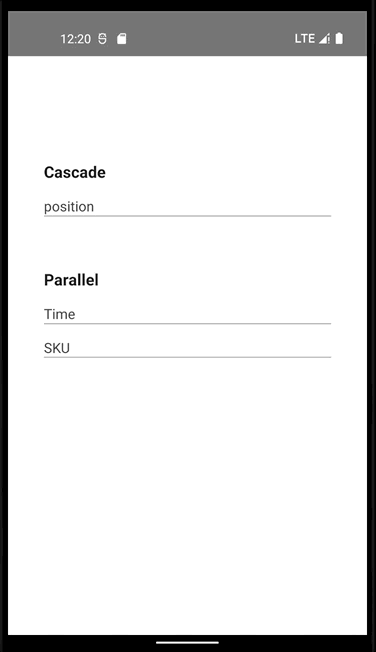

## react-native-slidepicker

一个 React Native 上的选择器组件，可以用在时间，地址以及各种分类选择的场景上。

  

<a href="https://github.com/the-nippy/react-native-slidepicker/blob/feature/absomask_flatlist/Example/example/index.tsx">例子demo 代码</a>

特点：

- 全部使用 RN 官方组件，纯 TS/JS 实现，兼容 Android 和 iOS 端
- 支持使用级联数据选择和平行数据选择
- 大部分样式可自定义：条目文字、背景色、整个选择器头部
- 自定义显示方式，默认在绝对定位的 Mask 中，可自定义容器放入选择器

为什么使用 Class Component？项目始于 2020 年，作者个人彼时对 Hooks 处于探索阶段，且当时项目主要使用 Class，故沿用了 Class 进行封装。

## 使用

安装库：

安装 (npm) :

```bash
npm install react-native-slidepicker -S
```

引入使用：

```javascript
import SlidePicker from "react-native-slidepicker";

//联动数据
<SlidePicker.Cascsde
	visible={true}
	data={...}
	values={...}
	// ...
/>

//平级数据
<SlidePicker.Parallel
	data={...}
/>
```

## 例子

使用例子：

```JSX
import SlidePicker from 'react-native-slidepicker';
import PARALLEL_TIME from './test_data/parallel_time.json';

export default class PickerTest extends Component {

  constructor(props: any) {
    super(props);
    this.state = {demoType : '', timeData: [] };
  }

  render() {
    return (
      <View style={{flex: 1}}>

        <SlidePicker.Parallel
          visible={this.state.demoType === 'parallel_time'}
          data={PARALLEL_TIME}
          values={this.state.timeData}
          wheels={2}
          checkedTextStyle={styles.checkedStyle}
          normalTextStyle={{fontSize: 14}}
          onCancelClick={() => this.setState({demoType: ''})}
          onConfirmClick={res => this.setState({timeData: res, demoType: ''})}
        />
      </View>
    );
  }
}

```

## props

组件的可用属性：

| prop                   | type ( \* 表示必需) | description                                                                                                                                | default                                          |
| ---------------------- | ------------------- | ------------------------------------------------------------------------------------------------------------------------------------------ | ------------------------------------------------ |
| visible                | boolean \*          | 是否可见                                                                                                                                   | false                                            |
| dataSource             | array \*            | 数据源，<a href='#data_demo'>查看级联和平行数据格式</a>                                                                                    | []                                               |
| values                 | array \*            | 选择后的值。用于下次打开时数据回显                                                                                                         | []                                               |
| wheels                 | number              | 表示有几轮数据                                                                                                                             | 2                                                |
| onMaskClick            | function            | 背景点击事件                                                                                                                               | null                                             |
| animationDuration      | number              | 启动和关闭的动画持续时间                                                                                                                   | 200                                              |
| checkRange             | number              | 可见选择项数                                                                                                                               | 3                                                |
| itemHeight             | number              | 选择项 item 高度                                                                                                                           | 60                                               |
| contentBackgroundColor | string              | 选择区域背景色                                                                                                                             | #f8f8f8                                          |
| contentBackgroundColor | string (color)      | 选择 item 分割线颜色                                                                                                                       | rgba(0,0,0,0.05)                                 |
| checkedTextStyle       | TextStyle           | 选中 item 文本样式                                                                                                                         | { fontWeight: '700',fontSize: 16,color: '#006' } |
| normalTextStyle        | TextStyle           | 选中 item 文本样式                                                                                                                         | { fontWeight: '400', fontSize: 14 }              |
| titleText              | string              | 选择器头部标题                                                                                                                             |                                                  |
| titleTextStyle         | TextStyle           | 选择器头部标题文本样式                                                                                                                     |                                                  |
| cancelText             | string              | 取消文本                                                                                                                                   | cancel                                           |
| cancelTextStyle        | TextStyle           | 取消文本样式                                                                                                                               | { fontSize: 15, color: 'rgb(42, 123, 152)' }     |
| onCancelClick          | function            | 取消事件                                                                                                                                   |                                                  |
| confirmText            | string              | 确认文本                                                                                                                                   | confirm                                          |
| confirmTextStyle       | TextStyle           | 确认文本样式                                                                                                                               | { fontSize: 15, color: 'rgb(42, 123, 152)' }     |
| onConfirmClick         | function            | 确认事件, (res) => { } 携带选择结果                                                                                                        |                                                  |
| HeaderComponent        | JSX element         | 自定义选择器头部组件（如果使用自定义选择器头部组件，默认头部会被替换，onConfirmClick 不会被调用 , 需要使用 ref 来调用 \_getValues 以取值） |                                                  |

<hr id="dataSource"></hr>

## 方法

如果你使用了自定义头部，那么就需要为 picker 组件设置 ref。然后将 ref 上的方法绑定到点击事件上才能获取到选择结果。

### `_getValues()`

除非你使用自定义头部，否则都应该使用 [confirm 方法](#confirm) 表示选定， 而不是使用这个方法。

通过设置 ref，可以实时获取到已选择的数据，但是触发时机并不好判定，因为已经有了 confirm 按钮和事件回调，应该优先使用 confirm 事件。

```JSX
export default class RefDemo extends Component {

  constructor(props: any) {
   	// ...
    this.skuRef = React.createRef();
  }

  render() {

    return (
      <View style={{flex: 1}}>
       <SlidePicker.Parallel
          ref={this.skuRef}
          // ....
          HeaderComponent={
            <View style={styles.header}>
              <View style={{flexDirection: 'row', alignItems: 'center'}}>
                <Image source={ICON_DOG} style={{width: 34, height: 34}} />
                <Text style={{marginLeft: 10}}>What you want?</Text>
              </View>
              <TouchableOpacity
                onPress={() => {
                  const res = this.skuRef?.current?._getValues();
                  console.info('res', res);
                  this.setState({skuData: res, demoType: ''});
                }}>
                <Text style={{fontWeight: '700'}}>Done</Text>
              </TouchableOpacity>
            </View>
          }
        />
      </View>
    );
  }
}
```

## Others

1. 项目采用 Class Component ，项目启动后未再变动，沿袭也为了兼容旧的 React & RN 版本。
2. 1.x 版本采用的是 react-native-gesture-handler 来处理手势，写了一套滚动处理，但是在 Android 机器上尤其是配合 react-native-modal 出现一些不稳定问题，对该库原生层问题无能为力。故 2.x 全部采用 RN 自带组件完成，主要为 FlatList.
3. 弹出层的处理。一般 Picker 组件内会带有弹出层，本组价的 `SlidePicker.Parallel` 和 `SlidePicker.Cascade` 采用绝对定位的 View 作为 Mask 容器来‘装载’选择器，所以需要将其放在页面级别的层级。如果想要自己处理弹出层，也可以使用 `SlidePicker.PureParallel` 和 `SlidePicker.PureCascade`，这是不带弹出层的纯选择器组件。

<div id="data_demo">

## 数据格式

<a href="https://github.com/the-nippy/react-native-slidepicker/tree/feature/absomask_flatlist/Example/example/test_data">例子 demo 数据格式 </a>


**级联数据**格式：

```json
[
  {
    "label": "",
    "value": "",
    "options": [
      {
        "label": "",
        "value": "",
        "options": [
          {
            "label": "",
            "value": "",
            "options": [{ "label": "" }]
          }
        ]
      }
    ]
  },
  {
    "label": "",
    "value": ""
  }
]
```

**平行数据**格式

```json
[
  [
    {
      "label": "",
      "value": ""
    },
    {
      "label": "",
      "value": ""
    },
    {
      "label": "",
      "value": ""
    }
  ],

  [
    {
      "label": "",
      "value": ""
    },
    {
      "label": "",
      "value": ""
    }
  ]
]
```
